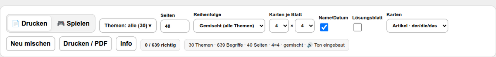
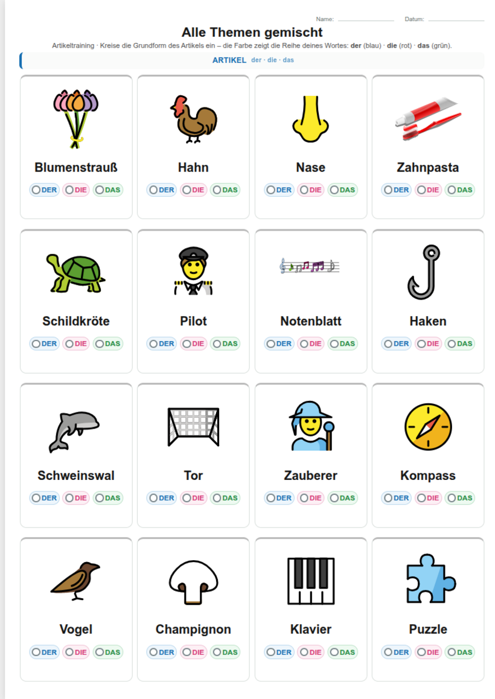
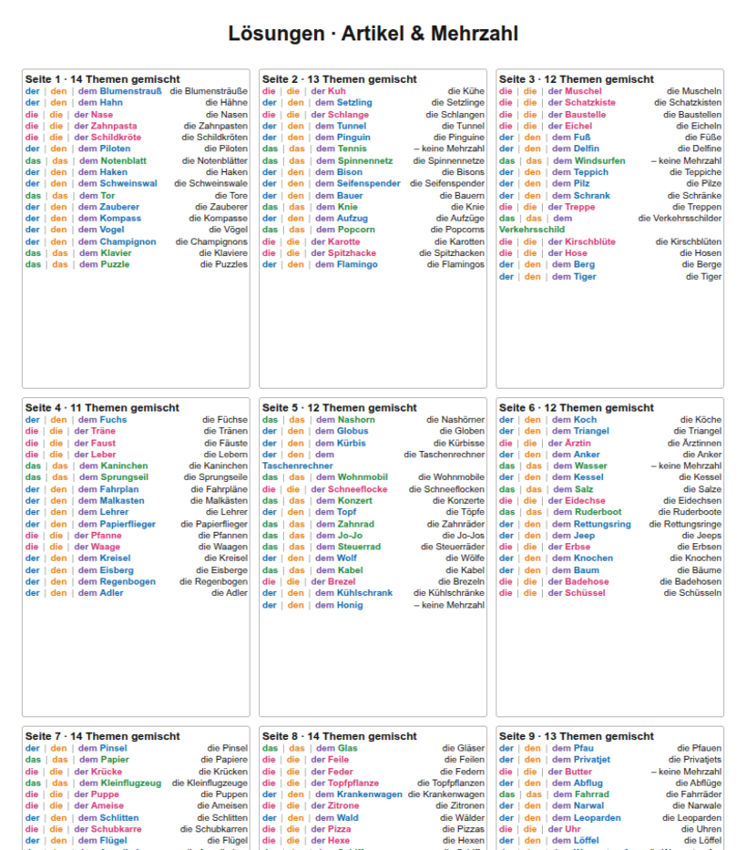
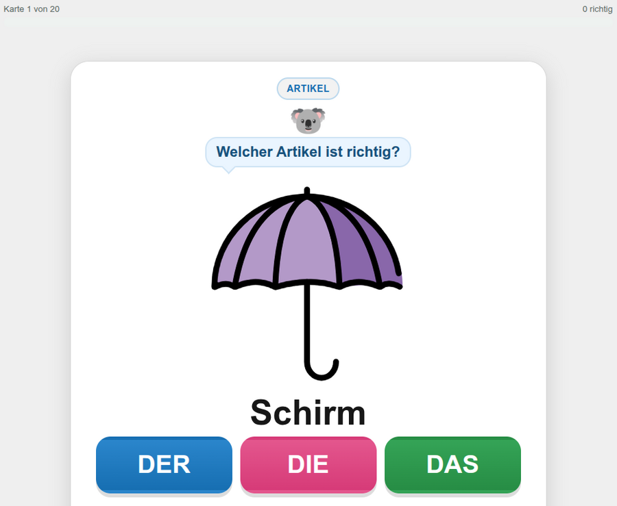
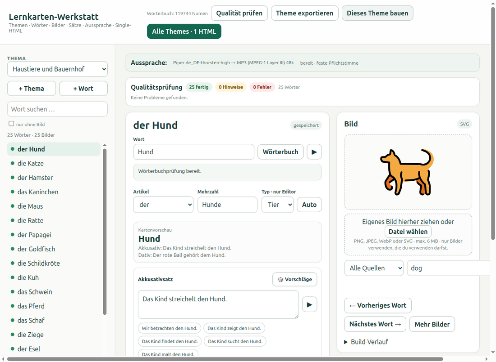
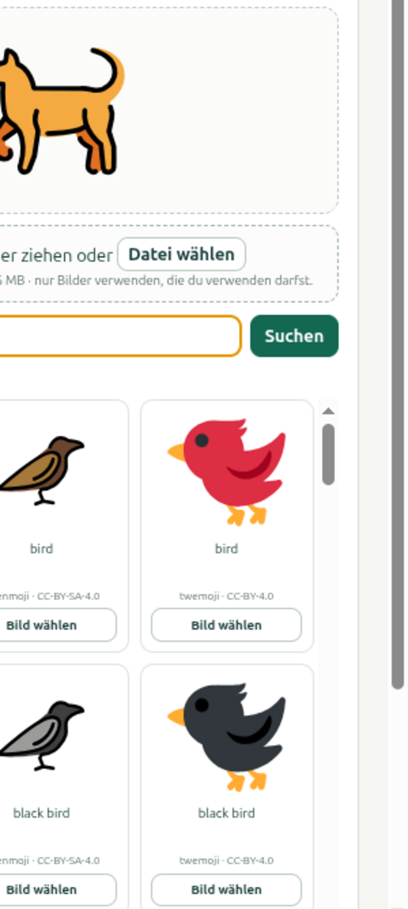
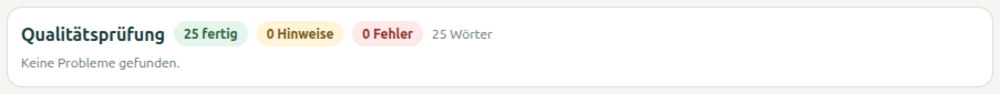

# DER · DIE · DAS – Lernkarten-Werkstatt 0.1

[](https://github.com/gyula-kokas/lernkarten-werkstatt/actions/workflows/build.yml)
[](LICENSE)

Deutsche Lernkarten für **der · die · das**, den **Kasus** (Akkusativ/Dativ) und die
**Mehrzahl** – mit Bildern und vorgelesenen Wörtern. Es gibt zwei Arten, das zu
benutzen:

| Ich möchte … | Weg |
|---|---|
| **nur üben** – nichts installieren | Die fertige Datei herunterladen und im Browser öffnen → [Für Lernende](#für-lernende-die-fertige-datei) |
| **eigene Karten** machen (Wörter, Bilder, Sätze) | Die Werkstatt installieren → [Für Autoren](#für-autoren-die-werkstatt-einrichten) |

Alles läuft **ohne Internet** und ohne Konto. Die Werkstatt ist ein Programm, das
nur auf deinem Rechner läuft; die fertige Lernkarten-Datei ist **eine einzige
HTML-Datei**, die man weitergeben, auf einen USB-Stick kopieren oder ausdrucken
kann.

---

## Für Lernende: die fertige Datei

**Nichts installieren.** Es genügt ein Browser (Firefox, Chrome, Edge, Safari).

1. Auf der [Release-Seite](https://github.com/gyula-kokas/lernkarten-werkstatt/releases/latest)
   die Datei **`lernkarten-alle-themes.html`** herunterladen (rund 35 MB).
2. Die Datei doppelklicken – sie öffnet sich im Browser wie eine Webseite.
3. Oben rechts zwischen **📄 Drucken** und **🎮 Spielen** wählen.

Zusätzlich liegt am selben Release **`wortuebersicht.html`**: das Kontrollblatt für Eltern,
Lehrkräfte und Prüfende. Es zeigt zu jedem Wort Artikel, Mehrzahl, beide Sätze und das Bild;
Bilder, die zwei Wörter teilen, sind markiert. Ein Klick auf eine Karte öffnet Bild und Sätze
groß, mit **←**/**→** blättert man weiter, mit **Esc** schließt man.

Beim Öffnen stehen die Karten nach wenigen Sekunden da; der Ton folgt ein paar
Sekunden später. Die Zeile oben zeigt das an: **⏳ Ton wird geladen** wird zu
**🔊 Ton eingebaut**. Solange kann man schon üben.

### 📄 Drucken oder als PDF speichern



Über den Blättern stehen alle Einstellungen. Was aufs Papier soll, wird **vorher**
gewählt:

- **Seiten** – wie viele Blätter gedruckt werden. Vorgabe: so viele, wie alle
  gewählten Wörter brauchen.
- **Reihenfolge** – *Gemischt* (Vorgabe: Wörter aus allen Themen bunt gemischt,
  jedes Wort genau einmal) oder *Nach Themen* (jedes Thema bekommt eigene Blätter).
- **Karten je Blatt** – Raster von **3×3** (große Bilder, gut für Anfänger) bis
  **8×8** (viel Stoff auf wenig Papier). Vorgabe ist **4×4**.
- **Name/Datum** – Zeile zum Ausfüllen oben auf jedem Blatt.
- **Lösungsblatt** – hängt hinten die Lösungen an (für Eltern/Lehrer).
- **Karten** – welche Aufgabe gestellt wird: **Artikel** (der/die/das, ohne Satz),
  **Kasus** (Satz mit Lücke, Akkusativ und Dativ gemischt) oder **Gemischt**.
- **Neu mischen** – würfelt die Wörter neu durch.



Zum Drucken **Drucken / PDF** drücken (oder Strg+P). Im Druckdialog:

- Papier **A4**, Hochformat
- Ränder auf **0** / „Standard“ und **Hintergrundgrafiken** einschalten
- Skalierung **100 %** (nicht „an Seite anpassen“)

Dann „Als PDF speichern“ wählen, wenn kein Drucker angeschlossen ist. Jedes Blatt
ist genau eine Seite.



### 🎮 Spielen



Anzahl Karten und Aufgabe wählen, dann **Neues Spiel**. Das Bild erscheint, das Wort
wird vorgelesen. Nach der Antwort geht es automatisch nach 10 Sekunden weiter –
oder sofort mit **Weiter ⏭️**; mit **⏸️ Anhalten** bleibt die Karte stehen, solange
man möchte.

**Die Farben** helfen beim Lernen: jede Antwortblase hat die Farbe ihrer
Artikelreihe.

| Reihe | Grundform | Akkusativ | Dativ |
|---|---|---|---|
| **der** – blau | der | den | dem |
| **die** – rot | die | die | der |
| **das** – grün | das | das | dem |

Im **Dativ** gibt es aber nur zwei Formen: `dem` für männliche **und** sächliche
Wörter, `der` für weibliche. Deshalb ist die `DEM`-Blase dort **grau** – die Farbe
würde in die Irre führen, im Dativ muss man das Geschlecht kennen.

---

## Für Autoren: die Werkstatt einrichten

Die Werkstatt ist ein kleines Programm, das die Themen, Wörter und Bilder verwaltet
und daraus die Lernkarten-Datei baut. Sie läuft auf **Windows** und **Linux**
(auch auf macOS) und braucht drei Dinge: **Python**, **Piper** (die Stimme) und
**ffmpeg** (für MP3).

> **Warum Piper und keine Stimme des Browsers?** Damit die fertige Datei überall
> gleich klingt und offline funktioniert, wird jeder Satz einmal vorgerendert und
> als MP3 in die HTML-Datei eingebettet. Deshalb gibt es genau diese eine Stimme –
> `de_DE-thorsten-high` (CC0, also frei) – und keinen Ersatz.

Die Einrichtung ist **einmalig** und braucht nur dabei Internet.

### Schritt 1: Python installieren

**Windows**

1. <https://www.python.org/downloads/windows/> öffnen und den Installer für
   **Python 3.12** (oder neuer) herunterladen.
2. Im Installer unbedingt **„Add python.exe to PATH“** anhaken (ganz unten im
   ersten Fenster) und dann „Install Now“.
3. Prüfen: `Win + R`, `cmd` eingeben, Enter, dann tippen:
   ```
   py --version
   ```
   Es muss so etwas wie `Python 3.12.4` erscheinen. (`py` ist der Python-Starter
   unter Windows; `python` geht auch, falls du es mitinstalliert hast.)

**Linux**

Python ist meist schon da. Prüfen:

```bash
python3 --version
```

Wenn nichts kommt:

```bash
sudo apt install python3 python3-venv python3-pip     # Debian/Ubuntu
sudo dnf install python3 python3-pip                  # Fedora
sudo pacman -S python                                 # Arch
```

### Schritt 2: ffmpeg installieren

**Windows** (PowerShell oder cmd):

```
winget install Gyan.FFmpeg
```

Falls `winget` fehlt: auf <https://www.gyan.dev/ffmpeg/builds/> die
**„release essentials“**-ZIP-Datei holen, nach `C:\ffmpeg` entpacken und den
Unterordner `bin` zum **PATH** hinzufügen (Windows-Suche → „Umgebungsvariablen“).
Danach `ffmpeg -version` in einem neuen Fenster prüfen.

**Linux**

```bash
sudo apt install ffmpeg        # Debian/Ubuntu
sudo dnf install ffmpeg        # Fedora (ggf. RPM Fusion nötig)
sudo pacman -S ffmpeg          # Arch
```

### Schritt 3: Piper mit der Stimme einrichten

Die Stimme wohnt in einem eigenen, abgeschotteten Python-Ordner („venv“), damit an
deinem System nichts verändert wird.

**Windows** (in `cmd`; `%LOCALAPPDATA%` ist dein Benutzerordner):

```
py -m venv "%LOCALAPPDATA%\ded-tts\venv"
"%LOCALAPPDATA%\ded-tts\venv\Scripts\pip.exe" install piper-tts
```

**Linux**

```bash
python3 -m venv ~/.local/share/ded-tts/venv
~/.local/share/ded-tts/venv/bin/pip install piper-tts
```

Jetzt das Projekt holen und die Stimme in den Projektordner laden:

```bash
git clone https://github.com/gyula-kokas/lernkarten-werkstatt.git
cd lernkarten-werkstatt
```

(Ohne git: auf GitHub „Code → Download ZIP“, entpacken, im entpackten Ordner weiter.)

**Windows** – im Projektordner (`vendor\piper` entsteht dabei):

```
"%LOCALAPPDATA%\ded-tts\venv\Scripts\python.exe" -m piper.download_voices de_DE-thorsten-high --download-dir vendor\piper
```

**Linux**:

```bash
~/.local/share/ded-tts/venv/bin/python -m piper.download_voices de_DE-thorsten-high --download-dir vendor/piper
```

Das lädt rund 110 MB (Stimme `de_DE-thorsten-high`, CC0-Lizenz).

### Schritt 4: Prüfen und starten

```bash
python3 tools/check_tts.py        # Windows: py tools\check_tts.py
```

Erwartete Ausgabe: `Piper de_DE-thorsten-high bereit · MP3 48k / 44100 Hz …`.
Wenn dort etwas fehlt, steht darunter der passende Befehl.

Dann die Werkstatt starten:

```bash
python3 bilder_waehlen.py         # Windows: py bilder_waehlen.py
```

Es öffnet sich der Browser mit:

```text
http://127.0.0.1:8765/
```

Die Werkstatt läuft nur auf deinem Rechner (`127.0.0.1`), ist also nicht von außen
erreichbar.

---

## Die Werkstatt benutzen



Die Oberfläche hat drei Bereiche: links **Thema und Wörter**, in der Mitte das
**gewählte Wort** mit Artikel, Mehrzahl und den beiden Sätzen, rechts das **Bild**.

### Ein Wort bearbeiten

1. Links ein Thema wählen und ein Wort anklicken.
2. Rechts das Bild aussuchen – Suchbegriff eingeben und **Suchen** drücken:
   
   Vorschläge kommen aus OpenMoji, Twemoji und ClipSafari. Unter jedem Vorschlag
   steht, woher er stammt. Ein eigenes Bild geht auch: einfach in das Feld ziehen
   oder **Datei wählen** (PNG, JPEG, WebP, SVG – bis 6 MB).
3. In der Mitte **Artikel** und **Mehrzahl** prüfen (das Wörterbuch schlägt sie
   vor) und beide **Sätze** schreiben – Akkusativ und Dativ. Die Vorschläge
   (🎲) sind nur Anregungen, sie werden nicht automatisch übernommen.
4. **Änderungen speichern**.

Jedes Wort braucht **beide** Sätze – sie sind auf den Karten die Aufgabe.

### Prüfen und bauen



Oben rechts:

- **Qualität prüfen** – prüft Bilder, Artikel, Mehrzahl, Sätze, doppelte Wörter und
  Abweichungen vom Wörterbuch. Ergebnisse erscheinen unter der Wortliste.
- **Theme exportieren** – schreibt das fertige Thema nach `selected-themes/`.
- **Dieses Theme bauen** – baut nur dieses Thema als HTML (schnell zum Ansehen).
- **Alle Themes · 1 HTML** – baut die eine Datei für alle Themen; sie landet in
  `output-selected/`. Das dauert ein paar Minuten: alle Sätze werden gesprochen.

Wichtig: **Vor „Alle Themes · 1 HTML“ einmal „Qualität prüfen“** – fehlt einem Wort
ein Satz oder Bild, bricht der Bau sonst mit einer Meldung ab.

---

## Was 0.1 kann

- Themen und Wörter am Bildschirm anlegen, bearbeiten und löschen
- Wörter, Artikel und Mehrzahl gegen ein **Offline-Wörterbuch mit 119.744 Nomen**
  prüfen (abgeleitet aus dem deutschen Wiktionary)
- Bilder suchen (OpenMoji, Twemoji, ClipSafari) oder eigene Bilder verwenden
- Sätze von Hand schreiben, mit Vorschlägen als Anregung und Anhören per Klick
- Qualitätsprüfung je Thema und für alle Themen
- Arbeitsblätter: Artikel-, Kasus- oder gemischte Aufgaben, gemischt oder nach
  Themen, Raster 3×3 bis 8×8, mit Lösungsblatt
- Lernspiel mit den drei Aufgabentypen Artikel, Kasus, Mehrzahl – und gemischt
- Ton überall offline: die Stimme steckt in der Datei
- Ausgabe: **eine** HTML-Datei, die ohne Installation auf jedem Rechner läuft

---

## Wenn etwas klemmt

| Problem | Lösung |
|---|---|
| `python3: command not found` | Python fehlt → [Schritt 1](#schritt-1-python-installieren). Unter Windows `py` statt `python3` verwenden. |
| `No module named venv` | Linux: `sudo apt install python3-venv` nachinstallieren. |
| `ffmpeg` nicht gefunden | [Schritt 2](#schritt-2-ffmpeg-installieren). Nach dem PATH-Setzen ein **neues** Terminal öffnen. |
| „Piper … nicht gefunden“ | Die Stimme wurde nicht gefunden. Den Befehl aus Schritt 3 noch einmal ausführen; `python3 tools/check_tts.py` zeigt, was fehlt. |
| Die Werkstatt findet Piper trotzdem nicht | Den Piper-Python fest vorgeben: Windows `set PIPER_PYTHON=%LOCALAPPDATA%\ded-tts\venv\Scripts\python.exe`, Linux `export PIPER_PYTHON=~/.local/share/ded-tts/venv/bin/python` (danach neu starten). |
| Datei geändert, aber im Browser noch alt | Im Browser **neu laden** (F5 / Strg+R). Bei `file://`-Dateien hilft notfalls ein neues Tab. |
| Druck sieht leer aus (Firefox) | War ein Fehler bis Version 0.1 → die aktuelle Datei von der Release-Seite verwenden. |

Weitere Fragen und Fehler bitte als
[Issue](https://github.com/gyula-kokas/lernkarten-werkstatt/issues) melden.

---

## Aufbau des Projekts und Technik

Wer wissen will, wie die Werkstatt innen aussieht – Aufbau, Datenformat, Bau der
Datei, Tests, Verzeichnisse – findet das in **[TECHNIK.md](TECHNIK.md)**.
Die Regeln für Beiträge stehen in [CONTRIBUTING.md](CONTRIBUTING.md), die
Sicherheitsentscheidungen in [SECURITY.md](SECURITY.md) und die Lizenzen der
Bilder und der Stimme in [THIRD_PARTY_NOTICES.md](THIRD_PARTY_NOTICES.md).

## Lizenz

Der Quellcode steht unter der **GNU General Public License v3.0**
(siehe [LICENSE](LICENSE)). Die eingebetteten Bilder stammen aus OpenMoji
(CC BY-SA 4.0), Twemoji (CC BY 4.0) und ClipSafari (CC0); die Pflichtangaben dazu
stehen in [THIRD_PARTY_NOTICES.md](THIRD_PARTY_NOTICES.md) und werden in jede
gebaute Lernkarten-Datei übernommen.
